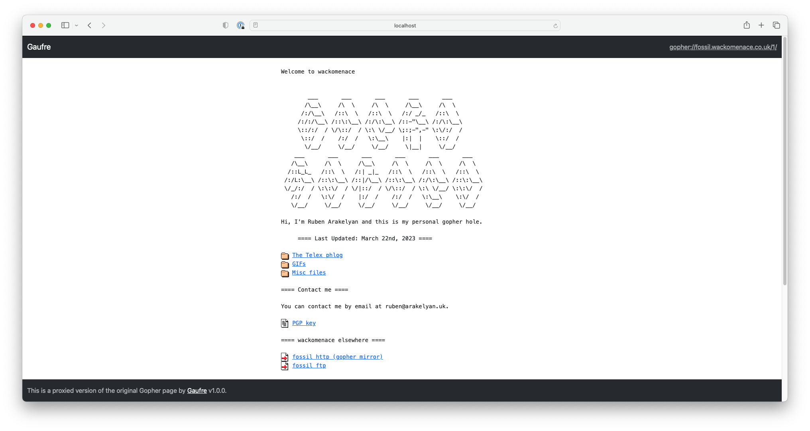

# Gaufre



A Gopher proxy for HTTP access to individual Gopher holes.

## Description

Gaufre is a Gopher proxy application written in Ruby and using the Ruby on Rails
framework. It is designed to be deployed by owners of individual Gopher holes
who want to provide access via HTTP without running a separate site or an open
proxy.

If you're looking for an open Gopher proxy, try [Gopher Proxy](https://gopherproxy.meulie.net/) or the
[Floodgap Public Gopher Proxy](https://gopher.floodgap.com/gopher/).

If you want to host the same content simultaneously over HTTP and Gopher using
a single app, try [PyGopherd](https://github.com/michael-lazar/pygopherd).

## Quick start

Ensure Ruby 3.2.1 is installed. Then, from the app directory, run:

```
cp .env.example .env
bundle install
bundle exec rails s
```

--------------------------------------------------------------------------------
Remember to edit your new `.env` file to set the hostname of your Gopher hole.

You may want to customise the puma configuration depending on traffic levels.
This is left as an exercise for the reader.

It is recommended that you run Gaufre behind a reverse proxy such as nginx to
provide traffic management, TLS termination etc.

## Environment variables

* `GOPHER_HOST`: the hostname of the Gopher hole to proxy (required)
* `GOPHER_PORT`: the port of the Gopher hole to proxy (optional; default: 70)
* `GOPHER_PATH`: the path of the Gopher hole to proxy (optional; use this if
  your Gopher hole is located on a shared server inside a user directory,
  for example)
* `INLINE_IMAGES`: whether to display images in the proxy (optional; default:
  `false`, in which case they will be offered for download)
* `TITLE`: the name of your instance of the Gopher proxy, which will be shown
  in page titles and the top navigation bar (optional)

## Testing

`bundle exec rspec`

Some specs related to Gopher requests is pending a good way of mocking
such requests.

## Bug reports

Please open an issue on the GitHub repository for any bugs.

## Contributing

All contributions are welcome. Feel free to fork the original GitHub
repository, make your changes and then open a Pull Request against the
original GitHub repository. Alternatively, if you're not comfortable
writing code, please open an issue.

## Thanks

Icons are from https://www.apache.org/icons/.

## Licence

[MIT licence](LICENSE)
